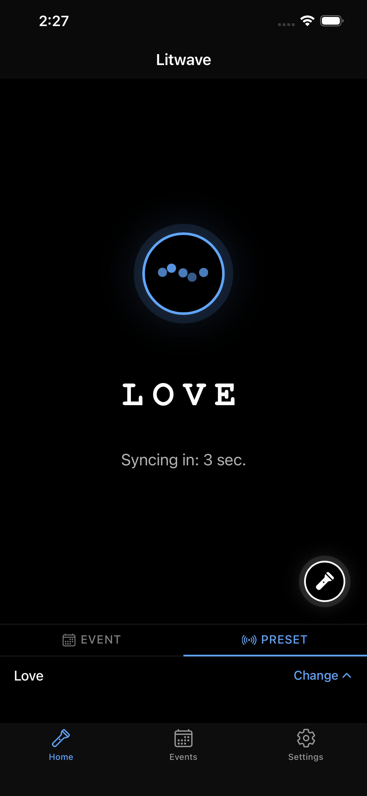
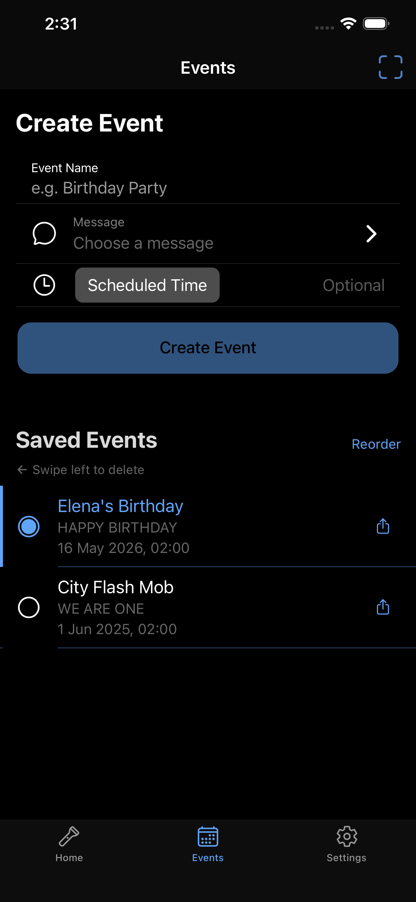

# Litwave

A mobile app that synchronizes smartphone flashlights and screens across any number of devices — no server, no Bluetooth, no Wi-Fi. Built with Angular 19 + Ionic 8 + Capacitor 8.

📱[**iOS beta (TestFlight)**](https://testflight.apple.com/join/mncgCJaP)

> [!TIP]
> TestFlight is Apple's beta testing platform — free to join.  
> App Store release coming soon.

[**Web companion (event creator)**](https://litwave.app)

---

## What makes it different

- **No infrastructure at all** — syncs any number of phones using NTP time that's already on every device; no server, no internet connection, no Bluetooth, no venue hardware required
- **Scales to any crowd** — a late-joining device calculates its position in the sequence from wall-clock time and snaps to the nearest letter boundary; no handshake, no coordinator, no messages between phones
- **Survives backgrounding** — when iOS/Android freezes JS timers, the engine recalculates from wall-clock time on resume instead of drifting out of sync
- **Zero-server event sharing** — full event payload encoded in the URL as base64; no backend lookup, works as a deep link or a QR code
- **Multilingual Morse** — Latin, Cyrillic (GOST), German/Scandinavian (ITU-R), Ukrainian; diacritic normalization for edge cases
- **Web companion** — litwave.app lets organizers create and share events from a browser without installing the app; the synchronized flash experience itself runs on the native app

---

## Screenshots

 

<!-- TODO: flash in action (screen white) -->
<!-- TODO: event sharing QR code -->
<!-- TODO: settings / signal timing calibration -->

---

## The interesting problem

Getting thousands of phones to flash in unison without any coordination infrastructure. The solution: every phone already shares the same time (NTP). Litwave uses **epoch-modulo alignment** — each device independently computes `Date.now() % repeatEvery` and starts its flash sequence at the same phase. No messages between devices are ever needed.

```
repeatEvery = ceil((sequenceLength + pauseLength) / 5000) * 5000
```

The slot size snaps to the nearest 5-second grid, giving a clean epoch boundary that all NTP-synced clocks agree on regardless of timezone or locale.

## Architecture

### Timing engine (`message-timing.ts`, `message.service.ts`)

The core is a reactive RxJS pipeline that produces a stream of `boolean` values — `true` = flash on, `false` = flash off — timed to dit-length intervals (300 ms):

```
trigger$ ──► timeToNextSequence$ ──► sequenceInterval$ ──► makeMorseStream$
                                                          ► joinPlay$
```

**Mid-cycle join** (`calcJoinBit`): a device joining mid-sequence doesn't wait for the next epoch boundary. It calculates the nearest upcoming letter boundary within the current cycle and starts playback from there. Enabled for messages ≥ 15 s; short messages just wait for the next epoch.

**Resume after background**: when iOS/Android suspends the app, JS timers freeze. On resume, `trigger$` emits `false → true` synchronously, which cancels any frozen interval via `takeUntil` and recalculates timing from wall-clock time using `defer(() => of(Date.now()))`.

The timing logic is pure functions with no Angular dependencies — testable in Node:

```
src/app/message-timing.ts   — buildConfig, calcTimeToNextSequence, calcJoinBit
src/app/morse-encode.ts     — text → Morse → boolean[]
src/app/message-timing.spec.ts — 37 Vitest tests including sync-correctness proofs
```

### Signal pipeline

```
MessageService.stream$ (shared Observable<boolean>)
  ├── SignalComponent  →  CSS class toggle  →  screen flash
  └── FlashlightService  →  Torch.enable() / Torch.disable()  →  LED
```

Both subscribers receive the same emission from a single `share()`d source. The Settings page exposes a screen fade transition (0–100 ms) and a flashlight delay offset (0–100 ms) with a live `– – –` test pattern so they can be tuned against each other.

### Event sharing (zero-server deep links)

All event data lives in the URL. The payload is JSON → UTF-8 bytes → URL-safe base64:

```
litwave://event?d=<base64>
https://litwave.app/event?d=<base64>
```

No server lookup needed. The companion PWA at [litwave.app](https://litwave.app) generates and decodes the same links from a browser.

### Morse encoding (`morse-encode.ts`)

Supports Latin, Cyrillic (GOST 9608), German/Scandinavian (ITU-R), and Ukrainian extensions. Unknown characters are normalized before encoding: NFD decomposition strips combining diacritics (ą → a, č → c), with explicit rules for ß → ss, œ → oe, ł → l. `encodeBinaryWithBoundaries` tracks letter-start bit indices in parallel with the encoding pass — used by `calcJoinBit` to find snap points.

## Stack

| Layer | Choice |
|---|---|
| Framework | Angular 19 + Ionic 8 |
| Native bridge | Capacitor 8 |
| Reactive | RxJS 7.8 |
| Testing | Vitest |
| Flashlight | `@capawesome/capacitor-torch` (no camera permission required) |
| QR scanning | `@capacitor/barcode-scanner` |
| Keep-awake | `@capacitor-community/keep-awake` |
| i18n | `@ngx-translate` — EN, RU, UK, DE, ES, FR, PT, PL |

## Running locally

```bash
npm install
npm start             # Angular dev server
npm test              # Vitest
npm run build         # production build
npm run build:website # static website → dist/website/
npm run lint
```

```bash
npx cap sync && npx cap open ios
npx cap sync && npx cap open android
```

## Origin

Started in February 2022 as "Organise!" — an app to flash "STOP WAR" in synchronized Morse code across thousands of phones during the early days of the Russia-Ukraine war. By the time it was ready to ship, Russia had introduced criminal sentences for public anti-war protest, making it too dangerous to publish. The app was shelved.

The synchronization technology sat unused until it became clear it had broader value for flashmobs and crowd events. Rebranded to Litwave and rebuilt from there.

## License

MIT © 2025 Evgenii Malikov
